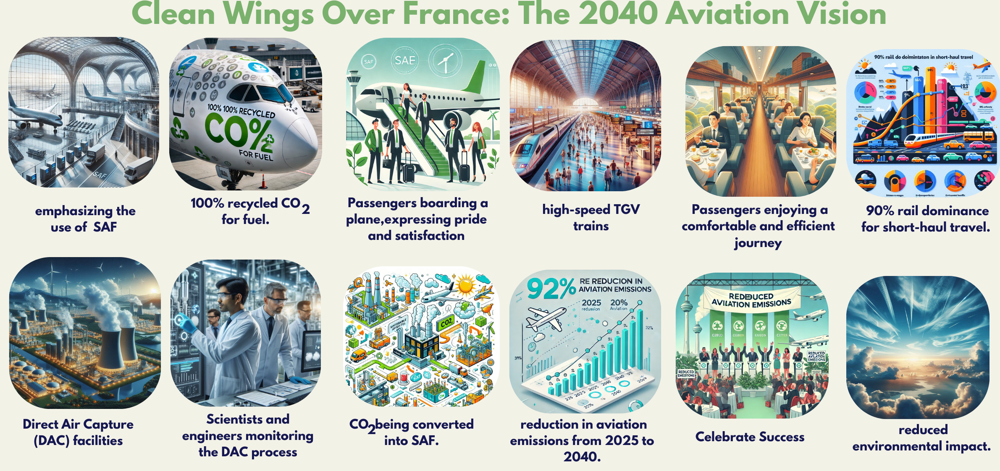
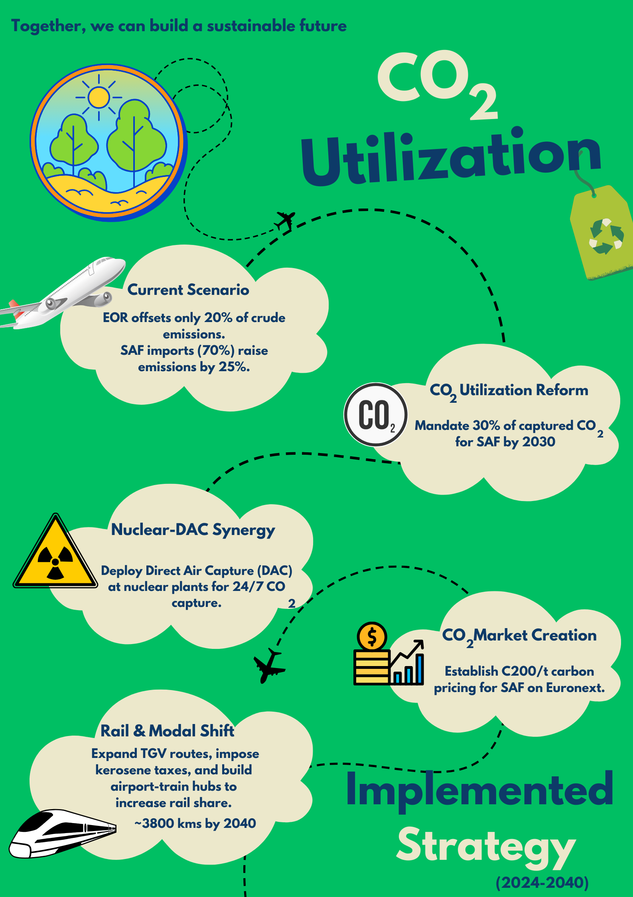

# Decarbonizing French Aviation: Addressing CO₂ Utilization & Modal Shift Challenges

## Why This Issue?
### Current State & Environmental Impact
- **France captures** 4.7 MtCO₂/year but allocates **<1% to SAF**, diverting **99% to enhanced oil recovery (EOR)**.
- **Missed Opportunity**: SAF production requires **3.88 kg CO₂ per kg of e-kerosene**. France’s unused CO₂ could produce **1.2 Mt/year of SAF** (30% of aviation fuel demand).

### Environmental Harm
- **EOR Extends Fossil Dependency**: CO₂ used for oil extraction offsets only **20% of emissions** from burned crude.
- **SAF Deficit**: Without CO₂ recycling, France imports **70% of SAF**, increasing lifecycle emissions by **25% (shipping).**

## Key Obstacles

| Category       | Challenges |
|---------------|------------|
| **Regulatory** | EU’s 2041 ban on industrial CO₂ for e-fuels jeopardizes cement/steel partnerships. |
| **Economic**   | EOR generates **€50/t revenue** vs. SAF’s **€20/t (no subsidies)**. |
| **Technological** | No domestic DAC facilities; reliance on U.S. startups like Climeworks. |

## Opportunities
- **Existing Infrastructure**: 45 industrial plants (cement, steel) can retrofit CO₂ capture for SAF.
- **Policy Alignment**: France 2030’s **€1.2B aerospace fund** prioritizes CO₂-to-fuel R&D.

## Diagnostic Diagram
```
[CO₂ Sources] → (4.7 Mt/year)  
    ├→ EOR (99%) → Fossil Lock-in  
    └→ SAF (1%) → Emission Reductions  
```

## Strategy in Action
### Solutions
1. **Policy Overhaul**: Mandate **30% of captured CO₂** for SAF by 2030 via **Carbon Valorization Act**.
2. **Nuclear-DAC Synergy**: Co-locate DAC units at EDF reactors (e.g., Flamanville) for 24/7 operation.
3. **CO₂ Market Creation**: Launch **SAF-linked carbon contracts (€200/t floor price)** on Euronext.

## Key Stakeholders & Challenges

| Stakeholder     | Role                            | Challenges  |
|----------------|--------------------------------|-------------|
| **DGAC**        | Enforce CO₂ quotas            | Balancing airline profitability |
| **TotalEnergies** | Retrofit refineries for SAF  | High CAPEX (€2B/plant) |
| **EU Commission** | Amend RED2 regulations       | Lobbying from oil states |
| **Citizens**     | Accept SAF cost premiums     | 15% higher airfares by 2030 |

## Action Plan

| Timeline      | Actions                                      | Success Metrics |
|--------------|--------------------------------|----------------|
| **2025–2027** | Pass **Carbon Valorization Act**<br>Launch **2 DAC pilot projects** | **10% CO₂ diverted to SAF** |
| **2028–2035** | Scale **nuclear-DAC hubs**<br>Retrofit **20 industrial plants** | **50% CO₂ used for SAF** |
| **2036–2040** | Full **SAF transition for domestic flights**<br>Ban **EOR-linked CO₂** | **100% aviation CO₂ recycled** |

## Communication Plan

| Audience      | Message                                  | Tools |
|--------------|--------------------------------|------------|
| **Policymakers** | "SAF cuts **75% lifecycle emissions** vs. EOR" | White papers, EU working groups |
| **Industry** | "€200/t SAF subsidies until 2035" | Webinars, tax incentive guides |
| **Public** | "Your flight’s CO₂ now powers future planes" | Social media campaigns |

## Modal Shift: Why Planes Over Trains?

### Root Causes in France
- **Time Efficiency**:
  - **Paris-Nice**: **TGV (5h40m) vs. flight (1h25m)**.
  - **Habit**: **68% of business travelers prioritize speed over sustainability**.
- **Cost & Accessibility**:
  - Airfare subsidies **€200M/year** vs. rail’s **€80M**.
  - **45% of regional airports lack direct TGV links**.
- **Comfort Perception**:
  - **52% of travelers rate planes as "more comfortable"** for luggage and seating.

## Environmental Impact Comparison

| Route                | CO₂ Emissions (kg/passenger) |
|----------------------|----------------------------|
| **Paris-Marseille (Plane)** | **120 kg** |
| **Paris-Marseille (TGV)** | **1.6 kg** |

## Action Plan for Modal Shift

| Timeline      | Actions                                      | Success Metrics |
|--------------|--------------------------------|----------------|
| **2025–2027** | Ban flights **under 2h** (extended from current **1.5h ban**) <br> Add **15 TGV routes** | **20% shift to rail** |
| **2028–2035** | Tax **kerosene €0.30/liter** <br> Build **10 airport-TGV hubs** | **50% rail share for <500km trips** |
| **2036–2040** | Full **rail electrification** <br> AI-optimized **multimodal tickets** | **90% rail dominance for domestic travel** |

## Success Indicators

| Year | Metric                        | Target |
|------|------------------------------|---------|
| **2030** | SAF production from CO₂ | **1.5 Mt/year** |
| **2035** | CO₂ utilization rate for SAF | **50%** |
| **2040** | Aviation emissions vs. 2025 | **92% reduction** |

France’s dual focus on **CO₂ recycling** and **modal shift** creates a blueprint for systemic decarbonization. By aligning **industrial policy** with **behavioral nudges**, the nation can transform aviation from a **climate liability** to a **circular economy showcase**.
- [`Access the summary here`](Summary.pdf) 
## Storyboard 
 
 
## Strategy Poster
 


